<p align="center">
  
</p>

<p align="center">
  
</p>

<p align="center">
  <a href="mailto:d.s.nichiporchik@gmail.com"></a>
  <a href="https://metarun.game/"></a>
</p>

<p align="center">
  
</p>

```cpp
// Dmitry Nichiporchik — Technical Director · Lead Software Developer
UCLASS()
class ADmitry : public ATechnicalDirector
{
    GENERATED_BODY()

public:
    FString Now       = TEXT("Mytaverse — enterprise immersive platform on UE5");
    FString Specialty = TEXT("Engine-level C++, console ports, cloud streaming");
    int32   YearsInUE = 8;    // since 2018, UE4 → UE5
    int32   PeakTeam  = 20;   // engineers in one org

    virtual void BeginPlay() override
    {
        BuildTeams();     // StoryMode 3 → 20+, a UE department from zero at iTechArt
        Ship();           // King's Bounty II, Cyberpunk 2077, Crime Boss, X8, MetaRun
        CutCloudCosts();  // 4× cheaper clients on AWS, 5× cheaper servers on ARM
    }
};
```

<p align="center">
  
</p>

<p align="center">
  
</p>

<p align="center">
  
</p>



<p align="center">
  
</p>


<p align="center">
  
</p>

<p align="center">
  <picture>
    <source media="(prefers-color-scheme: dark)" srcset="https://raw.githubusercontent.com/Koous61/Koous61/output/snake-dark.svg" />
    <source media="(prefers-color-scheme: light)" srcset="https://raw.githubusercontent.com/Koous61/Koous61/output/snake-light.svg" />
    
  </picture>
</p>

<p align="center">
  
</p>
